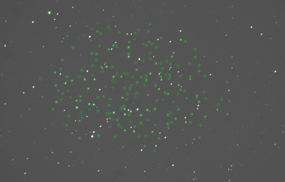
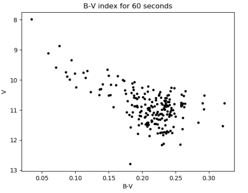
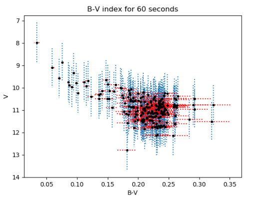
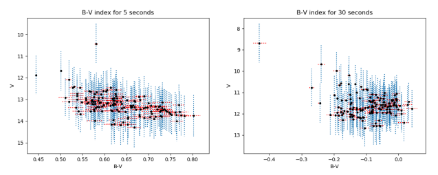

# region-drift

Produces the data analysis portion for a 3rd year star lab. The errors in the Hertzsprung-Russell diagrams
are determined using the following equations:

$$
\begin{align}
  \Delta\log(x) &= \frac{\Delta x}{x\ln(10)}\\
  \Delta\sec(x) &= \sec(x)\tan(x)\Delta x\\
  \Delta(xy) &= |xy|\sqrt{\left(\frac{\Delta x}{x}\right)^2 + \left(\frac{\Delta y}{y}\right)^2}\\
  \Delta(x+y) &= \sqrt{(\Delta x)^2 + (\Delta y)^2}
\end{align}
$$

The absolute magnitudes are calculated using the apparent magnitudes:

$$
\begin{align}
  B &= v - k_v\sec(z) + \alpha_v(b-v)+\beta_v\\
  V &= b - k_b\sec(z) + \alpha_b(b-v)+\beta_b
\end{align}
$$

and were solved for the various images using regression analysis. The raw image of M35 with regions, shown below:

  

was used to generate the Hertzsprung-Russell diagrams for images with various exposure times. From the HR diagrams, 
we were able to determine the approximate age of M35 was 150 million years. The stars observed had spectral classes
primarily of A and F.

## HR Diagrams

  
  
  

